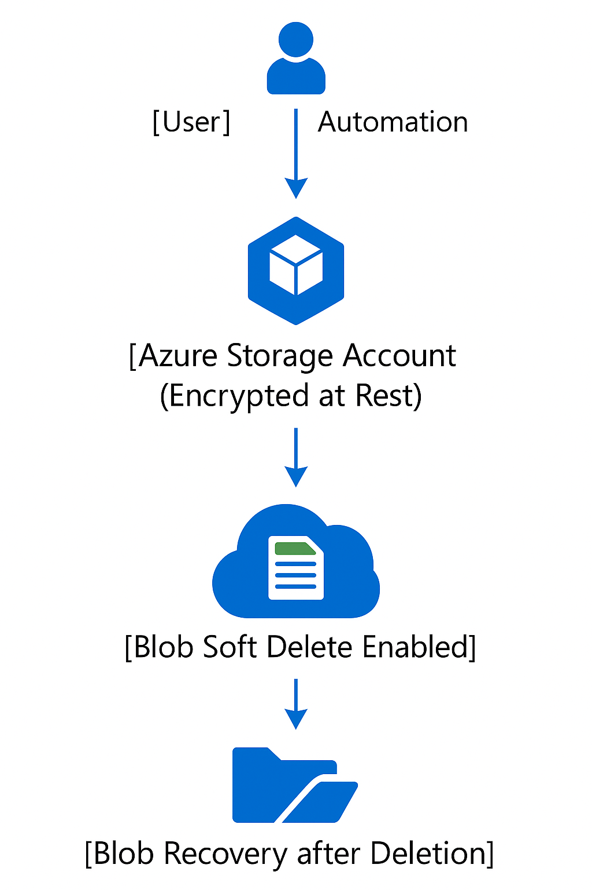

## Azure Storage Encryption & Soft Delete Lab

Securing Azure Storage Accounts with encryption-at-rest and Blob Soft Delete to protect and recover data in the cloud.

---

## Table of Contents

- [Overview](#overview)
- [Real-World Risk](#real-world-risk)
- [What I Built](#what-i-built)
- [Diagram](#diagram)
- [Objectives](#objectives)
- [Steps Performed](#steps-performed)
  - [1. Resource Group Creation]
  - [2. Key Vault Setup]
  - [3. Customer-Managed Key Generation]
  - [4. Storage Account Creation & Encryption] 
  - [5. Blob Soft Delete Configuration]
  - [6. Blob Container and Test Data Upload] 
  - [7. Deletion and Soft Delete Demo] 
  - [8. Data Recovery] 
  - [9. Customer-Managed Key Setup]
- [Screenshots](#screenshots)
- [Lessons Learned](#lessons-learned)
- [Notes & Limitations](#notes--limitations)
- [References](#references)
- [Contact](#contact)

---

## Overview

This lab demonstrates how to secure Azure Storage Accounts with encryption-at-rest and data recoverability using Blob Soft Delete. The focus is on real-world, enterprise-grade data protection skills that are in high demand by employers.

---

## Real-World Risk

- **Unencrypted storage and lack of recovery controls lead to data breaches, regulatory fines and permanent data loss.**  
- Encryption at rest is required by most compliance frameworks (GDPR, HIPAA, PCI-DSS).  
- Blob Soft Delete protects organizations from accidental or malicious data deletion, including ransomware scenarios.

---

## What I Built

- Created an Azure Storage Account with encryption at rest (Microsoft-managed keys).
- Enabled Blob Soft Delete with custom retention settings.
- Demonstrated real data recovery by deleting and restoring a blob.
- Attempted Customer-Managed Keys (CMK) for above-baseline security (documented platform limitations).

---

## Diagram

---

## Objectives

- Ensure all data at rest in Azure Storage is encrypted.
- Implement recovery controls to prevent permanent data loss.
- Demonstrate real Azure security operations for recruiters and hiring managers.
- Attempt above-baseline encryption management (CMK) and document findings.

---

## Steps Performed

**1. Resource Group Creation**  
   - Created a dedicated resource group for lab resources *(Screenshot: `create-resource-group.png`)*

**2. Key Vault Setup**  
   - Deployed an Azure Key Vault in the resource group for secure key storage *(Screenshot: `create-key-vault.png`)*

**3. Customer-Managed Key Generation**  
   - Generated a new encryption key in Key Vault for potential use with customer-managed encryption *(Screenshot: `generate-customer-managed-key.png`)*

**4. Storage Account Creation & Encryption**  
   - Created a StorageV2 account and reviewed encryption settings.  
   - Attempted to configure customer-managed key (CMK) encryption.  
   - If not possible, confirmed Microsoft-managed key encryption as baseline *(Screenshot: `storage-account-creation-encryption.png`, `encryption-customer-managed-key.png` & `encryption-microsoft-managed-key.png`)*

**5. Blob Soft Delete Configuration**  
   - Enabled Blob Soft Delete with custom retention period to protect against accidental/malicious deletion *(Screenshot: `enable-blob-soft-delete.png`)*

**6. Blob Container and Test Data Upload**  
   - Created a test blob container and uploaded a sample file for deletion/recovery demonstration.

**7. Deletion and Soft Delete Demo**  
   - Deleted the test blob from the container.  
   - Demonstrated the “Show deleted blobs” feature *(Screenshot: `view-deleted-blob.png`)*

**8. Data Recovery (Undelete)**  
   - Used the soft delete feature to restore the deleted blob *(Screenshot: `blob-restored.png`)*

**9. Customer-Managed Key Setup (Optional)**  
   - Attempted to configure customer-managed key, documented any Azure limitations encountered *(Screenshot: `customer-managed-key-setup.png`)*

---

## Screenshots

*All screenshots are included in the `screenshots/` folder.*

| Step | Filename                                | Description                                        |
| ---- | --------------------------------------- | -------------------------------------------------- |
| 1    | create-resource-group.png               | Resource group created for the lab                 |
| 2    | create-key-vault.png                    | Key Vault creation and configuration               |
| 3    | generate-customer-managed-key.png       | New key generated in Azure Key Vault               |
| 4    | storage-account-creation-encryption.png | Storage account creation and encryption review     |
| 4    | encryption-customer-managed-key.png     | (Bonus) CMK settings in storage account            |
| 4    | encryption-microsoft-managed-key.png    | Default Microsoft-managed key encryption confirmed |
| 5    | enable-blob-soft-delete.png             | Blob Soft Delete enabled in Data protection        |
| 7    | view-deleted-blob.png                   | Deleted blob visible with retention countdown      |
| 8    | blob-restored.png                       | Blob restored via soft delete                      |
| 9    | customer-managed-key-setup.png          | (Bonus) Attempt to set up customer-managed key     |

---

## Lessons Learned

- Encryption at rest is always enabled by default, but knowing how to check and document this is essential for compliance.
- Soft delete is a critical data loss prevention control and hands-on recovery demonstrates real value to teams.
- Platform limitations (e.g., inability to enable CMK due to Azure config/region/SKU) are normal—documenting these shows practical experience and transparency.

---

## Notes & Limitations

- Customer-managed key (CMK) setup was attempted, but managed identity integration was unavailable in this subscription/region/SKU at the time of lab, therefore, I proceeded with Microsoft-managed keys.
- All steps documented for reproducibility and audit trail.
- Retention period for soft delete can be adjusted to meet business/compliance requirements.

---

## References

- [Azure Storage Account Encryption at Rest](https://docs.microsoft.com/en-us/azure/storage/common/storage-service-encryption)
- [Azure Blob Storage: Soft Delete](https://docs.microsoft.com/en-us/azure/storage/blobs/soft-delete-blob-overview)
- [Azure Security Documentation](https://docs.microsoft.com/en-us/azure/security/)
- [Official Microsoft Learn Labs](https://learn.microsoft.com/en-us/training/modules/secure-azure-storage-account/)

---

## Contact

Sebastian Silva C. – July, 2025 – Berlin, Germany.  
[LinkedIn](https://www.linkedin.com/in/sebastiansilc) | [GitHub](https://github.com/SebaSilC) | [sebastian@playbookvisualarts.com](mailto:sebastian@playbookvisualarts.com)
